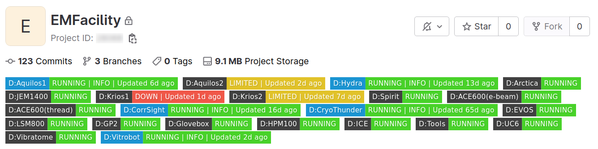

# facility-autobadge

Facility badge creates a traffic light system for facility devices on your gitlab repo startpage. The traffic light system gets automatically updated based on the issues in the issues list. In that way, all users of the facility know the current status of the devices:



This project was developed in cooperation with the EM-Facility managers at the MPI-Dortmund Daniel Prumbaum and Oliver Hofnagel.

## Traffic system rules
The badges are automatically updated by using gitlab webhooks, according the following rules:

- For each label starting "D:" it creates a batch with either the status "RUNNING", "LIMITED" or "DOWN".
- For a given device label ("D:XXX") it will set the status to:
    - "RUNNING" if there is no issue with the device label
    - "RUNNING | INFO" Important information available.
    - "LIMITED" if there is an issue with the device label or
    - "DOWN" if there is an issue with the device label and additionally it has the label "CRITICAL" assigned
    
The created badges get sorted according the label colors, that allows the grouping of devices.

Issues with the label "logbook" will be ignored.

## Installation

The facility-badge server needs to reachable by your gitlab installation. It does not need any special hardware.  I assume that you already created a gitlab repository where the issue system should working on.


### 1. Configure the script

On your server do the following

1. Clone the repository using git and navigate into the repo directory

2. Create the conda environment `autobadge`:
    ```bash
    conda create --name "autobadge" --file=config/conda_env.yml
    ```

    Check the path to your new conda environment with

    ```
    conda env list
    ```

    You will need the path later.

3. Create the configuration file
    Navigate to the `config` directory, make a copy of the sample configuration file named `badger.toml`:
    ```bash
    cd config
    cp badger_sample.toml badger.toml
    ```
    Now fill in your details into the badger.toml

### 2. Start the service

We keep the badgeserver running in the background by using a systemctl service. If you server is running ubuntu, you can setup it as follows:

1. Create a new service file `autobadge.service` in `/etc/systemd/system/` with the follwoing content:

    ```
    [Unit]
    Description=Autobadge gitlab server
    After=network.target

    [Service]
    User=YOUR_USER
    Group=YOUR_GROUP
    WorkingDirectory=/path/to/folder/which/contains/the/main/dot/py/
    ExecStart=/path/to/autobadge/conda/environment/bin/uvicorn main:app --host 0.0.0.0 --port 8000

    [Install]
    WantedBy=multi-user.target
    ```
2. Start the new service with:
    ```
    sudo systemctl start autobadge.service
    ```

3. Check if it started without errors:
    ```
    sudo systemctl status autobadge.service
    ```
4. Enable the service to get it restarted in case of a reboot:
    ```
    sudo systemctl enable autobadge.service
    ```

### 3. Setup your gitlab repository

1. Create a label for each of your devices under `Project information -> Labels`. Make sure that each device label start with "D:".

2. Create a label named `CRITICAL`

3. Create a label named `Information`

4. Create a access token unter `Settings -> Access Tokens` token with the following permissions for Role 'OWNER':
    - API
    - READ_API

    Make sure that you copy the your access token. 

4. Setup the webhook under `Settings -> Webhook`

    - Set the URL to: `http://ip.to.your.server:8000/update/YOUR_ACCESS_TOKEN
    
        Replace YOUR_ACCESS_TOKEN with your access token ;-)

    - Activate `Mask portions of URL`
        - Set the field `Sensitive portion of URL` to YOUR_ACCESS_TOKEN and `How it looks in the UI ` with "SECRET"
    - Activate the checkboxes:
        - Issue events
        - Confidential issues events
        - Comments
        - Confidential comments
    - Disable SSL Verification

    - Click "Add webhook"

5. Now you are basically ready! Test it with by clicking on the `Test` dropdown list and select `Issue events`. If you go back to your repo start page, you should see a all badges in green :-)

You can now start create issues and it will update the traffic light system according the `Traffic system rules` mentioned above.